# QuickLoan - Loan Application System on AWS

A 3-tier loan application system deployed on AWS using EC2, VPC, S3, and Auto Scaling.

The application allows users to submit loan applications through a web form, which are stored in a MySQL database running on a private, isolated server. Loan category images are served securely from Amazon S3, the app is accessible through a custom domain, and the infrastructure is set up to scale automatically for high availability.

## 🚀 Project Demo

**Application form submitted successfully:**

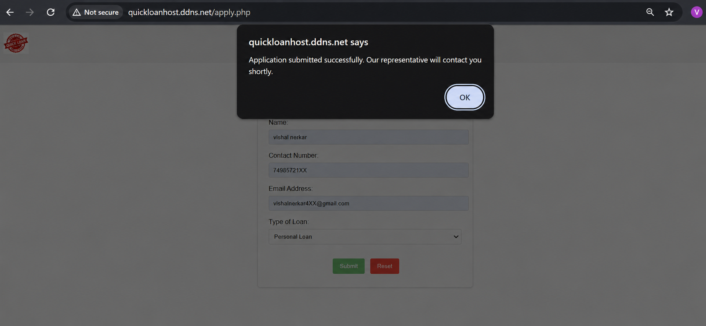

## ✨ Features
- Submit loan applications through a web form
- Store application data securely in a MySQL database
- Serve images and static assets from Amazon S3
- Access the app via a custom domain
- Auto Scaling for high availability and fault tolerance
- Isolated database tier with no direct internet exposure

## 🏗️ Architecture
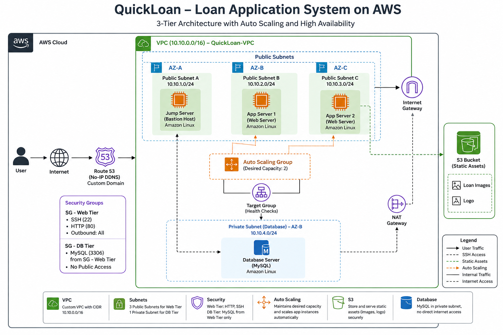

## 📸 Project Implementation

**Step 1: Create a Custom VPC**

Created a VPC (`QuickLoan-VPC`) with CIDR `10.10.0.0/16` to isolate the application's network from other resources.

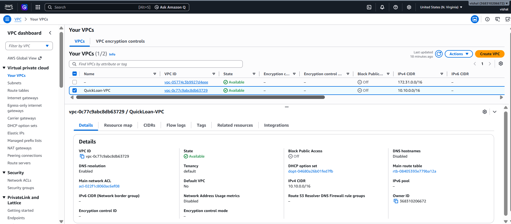

**Step 2: Create Subnets**

Created 3 public subnets (jump server, web server-1, web server-2) and 1 private subnet (database) across different Availability Zones for fault tolerance.

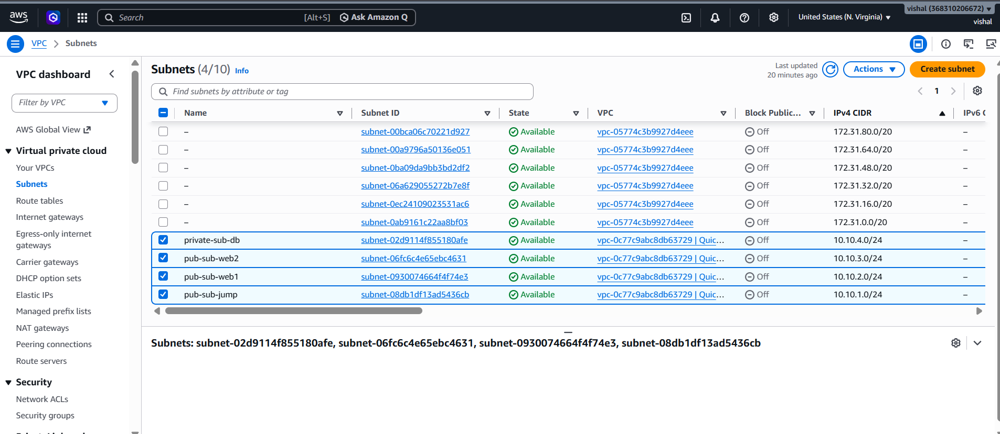

**Step 3: Configure Route Table & Internet Gateway**

Attached an Internet Gateway to the VPC and created a public route table (`0.0.0.0/0 → IGW`), associated with the public subnets so they can reach the internet.

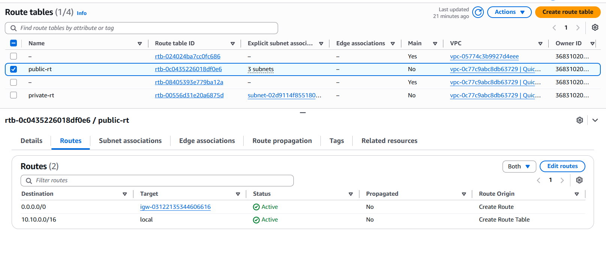

**Step 4: Configure Security Groups**

Created separate security groups for the web tier and database tier — the web tier allows HTTP/SSH, while the database tier only accepts MySQL connections from the app server.

**Step 5: Launch EC2 Instances**

Launched 3 Amazon Linux instances: `jump-server` (bastion host), `app-server` (runs the application), and `database-server` (hosted in the private subnet).

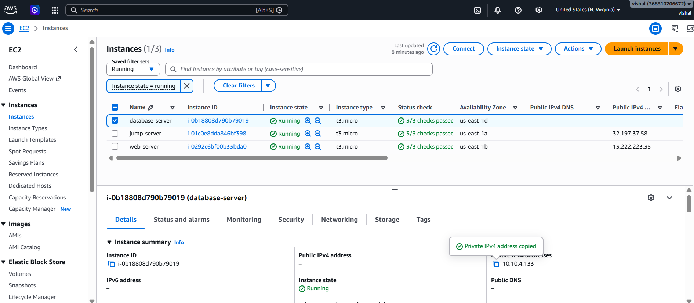

**Step 6: Set Up the Application Server**

Installed and configured Nginx and PHP-FPM on the app server, then deployed the application code (`includes`, `nginx`, `public` folders) using WinSCP, with correct ownership and permissions set on the web root.

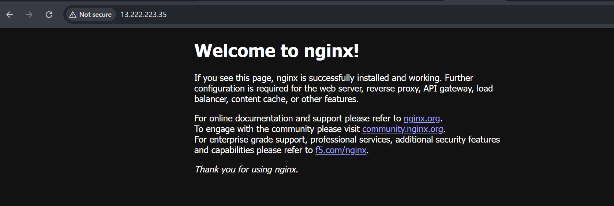

**Step 7: Create an S3 Bucket for Static Assets**

Created an S3 bucket to store loan category images and the logo, and updated the application code to fetch these assets directly from the S3 bucket URL.

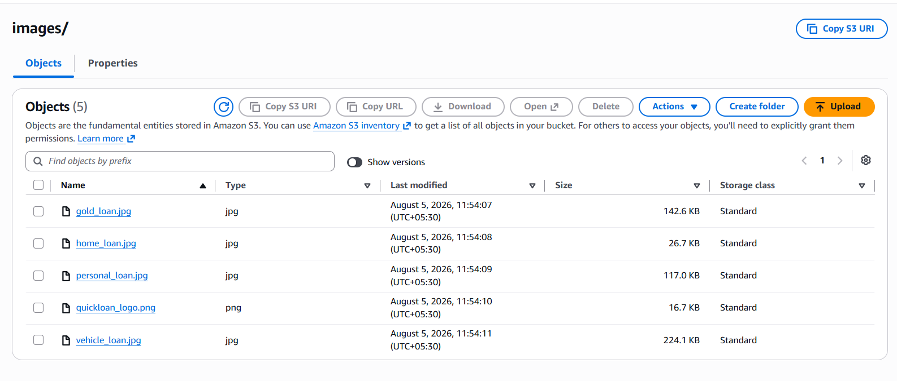

**Step 8: Set Up the Database**

Connected to the private database server via the jump server, created the database and an `applications` table, and updated the app server's connection file with the correct endpoint and credentials.

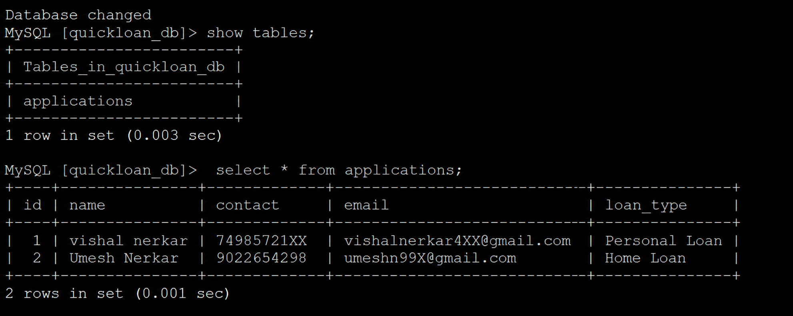

**Step 9: Map a Custom Domain**

Registered a free domain using No-IP (DDNS), pointed it to the app server's public IP, and updated the Nginx configuration — making the application accessible via a proper domain name.

**Step 10: Create a Launch Template**

Created a Launch Template from the fully configured app server so identical instances could be launched automatically for scaling.

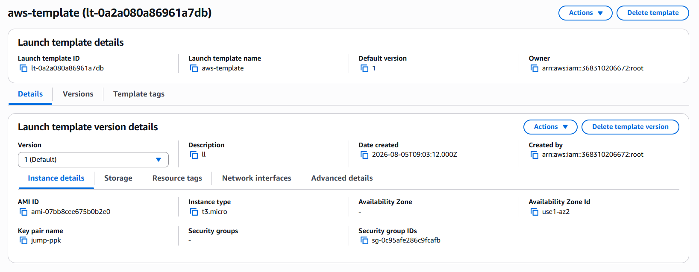

**Step 11: Create a Target Group**

Created a Target Group to route traffic and run health checks on the application instances.

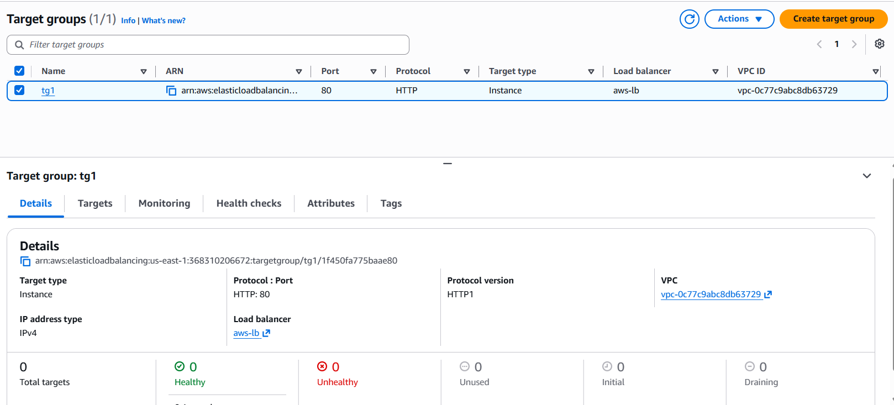

**Step 12: Create an Auto Scaling Group**

Configured an Auto Scaling Group using the Launch Template and Target Group with a desired capacity of 2 instances, ensuring the app stays available even if an instance fails.

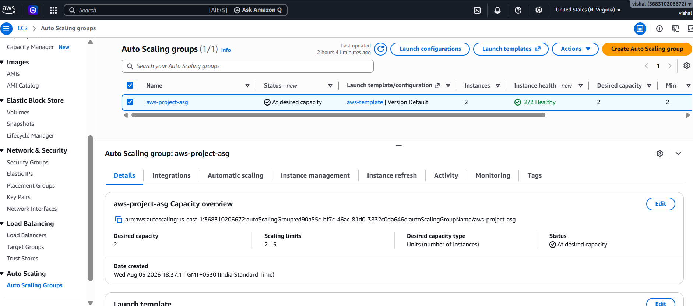

**Step 13: Verify the Final Setup**

Confirmed all instances (original servers + Auto Scaling instances) were running and healthy, and verified the application by submitting a loan application through the live domain.

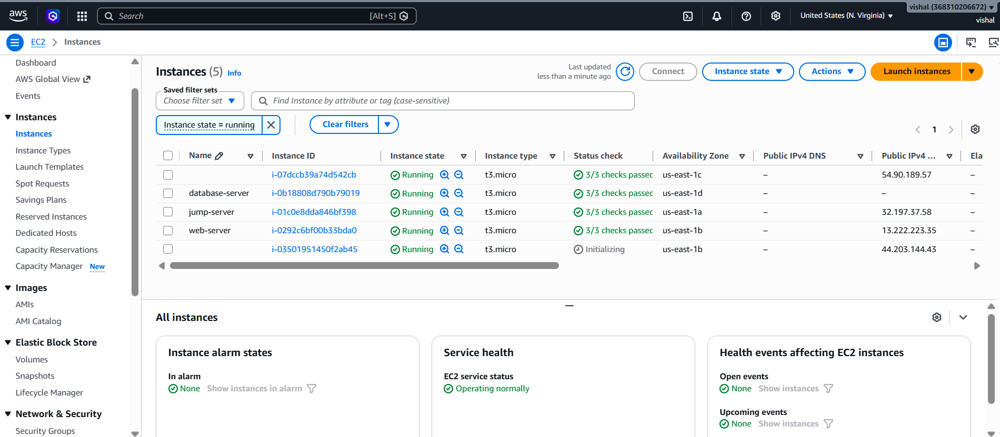

## 🔐 Security Implementation
- **Private Database Subnet:** The database server has no direct internet exposure.
- **Separate Security Groups:** Web and database tiers have independent, minimal-access rules.
- **Bastion Host Access:** The database is only reachable through the jump server, not directly.
- **NAT Gateway:** Allows the private subnet to reach the internet for updates without being publicly accessible.

## 🔄 Application Workflow
1. The user opens the application via the custom domain.
2. The user fills out and submits the loan application form.
3. The app server (PHP) processes the request and connects to the database server.
4. The application data is stored in the MySQL database.
5. Loan category images are loaded from the Amazon S3 bucket.
6. If traffic increases, the Auto Scaling Group launches additional app instances automatically.

## 🎯 Key Learnings
Through this project, I gained hands-on experience with:
- Designing a custom VPC with public and private subnets
- Configuring Nginx and PHP-FPM on Amazon Linux
- Connecting an application to Amazon S3 and a remote MySQL database
- Mapping a custom domain to an EC2 instance
- Using Launch Templates, Target Groups, and Auto Scaling Groups for scalability

## 🚀 Future Improvements
- Add an Application Load Balancer in front of the Auto Scaling Group
- Enable HTTPS using a proper SSL certificate
- Add CloudWatch alarms for monitoring and scaling triggers
- Move database credentials to AWS Secrets Manager
- Add input validation and form security on the frontend

## 👨‍💻 Author
**Vishal Nerkar**

If you found this project helpful, feel free to give it a star.
